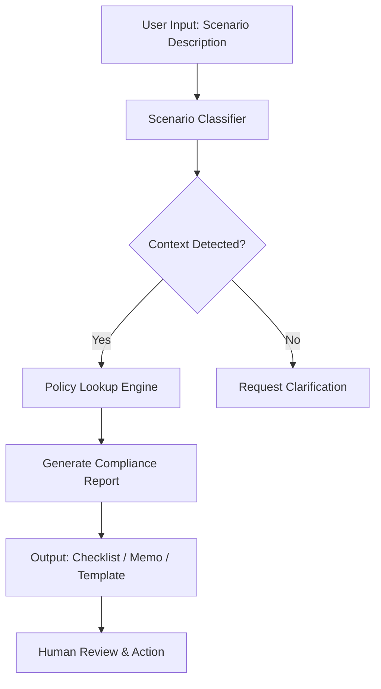

# Neurorights Defense Playbook

This playbook shows how to use Perplexity-Truth to **analyze, document, and push back** against unfair or unlawful neural data collection — especially in private residences and virtual ecosystems.

It turns neurorights theory into a concrete workflow:
- Identify when **neural data** is at stake.
- Map the situation to **laws, policies, and neurorights**.
- Generate a **checklist and summary** that users, lawyers, and regulators can act on.

***

## 1. Key concepts: neurorights and neural data

Before using the tool, understand the core concepts it relies on.

- **Neural data**  
  - Any data derived from brain activity or closely related physiological signals (EEG, BCI signals, neural imaging) that can reveal mental states, intentions, or emotions.

- **Neurorights** (emerging but influential ideas)
  - **Mental privacy**: Right to keep thoughts and mental states free from unauthorized access.  
  - **Cognitive liberty**: Freedom to control your own mental processes without coercive intervention.  
  - **Identity integrity / psychological continuity**: Right to a coherent sense of self without external manipulation.  
  - **Neural data autonomy**: Control over how neural data is collected, stored, used, and shared.

- **Why neural data is special**  
  - It can indirectly reveal thoughts, feelings, and vulnerabilities.  
  - Abuse of neural data can undermine freedom of thought and conscience, which international law treats as a near-absolute right.

Perplexity-Truth uses these concepts as a lens when analyzing any situation that smells like "brain data + technology."

***

## 2. Workflow Overview



***

## 3. Step 1: Scenario Intake

Collect a structured description of the neural-data practice under review. Required fields:

```yaml
scenario:
  context: home | virtual_ecosystem | workplace | school | medical
  technology: eeg_headset | bci_implant | vr_neuro_wearable | ar_attention_tracker
  data_types:
    - raw_neural_signals
    - inferred_emotional_state
    - cognitive_load_metrics
    - intention_predictions
  collection_method: explicit_consent | implicit_collection | covert_inference
  data_uses:
    - primary_function
    - advertising
    - ai_training
    - third_party_sharing
  jurisdiction: US-CO | US-CA | EU | global
```

***

## 4. Step 2: Classification

The scenario classifier maps input to policy themes:

```rust
// Pseudocode: src/rust/classifier.rs
pub fn classify_scenario(input: ScenarioInput) -> ClassificationResult {
    let context_tags = detect_context_keywords(&input.description);
    let tech_tags = detect_technology_keywords(&input.description);
    let risk_level = assess_risk_level(&input.data_types, &input.data_uses);
    
    ClassificationResult {
        primary_context: context_tags.primary,
        technology_category: tech_tags.category,
        policy_themes: derive_policy_themes(&context_tags, &tech_tags),
        risk_score: risk_level,
        jurisdiction_hints: infer_jurisdiction(&input.jurisdiction),
    }
}
```

Key classification outputs:
- `home_private_use`: Triggers sensitive-data consent requirements
- `virtual_platform_tracking`: Flags subliminal manipulation risks
- `workplace_monitoring`: Activates emotion-inference prohibitions
- `medical_research`: Applies HIPAA/GDPR health-data safeguards

***

## 5. Step 3: Policy Lookup

Query the `neural_policies` SQLite table for jurisdiction-specific rules:

```sql
-- Example query: schemas/neural_policies.sql
SELECT rule_text, source_url, tier
FROM neural_policies
WHERE jurisdiction IN ('US-CO', 'global_hr')
  AND topic IN ('consent', 'subliminal_manipulation')
  AND tier <= 2
ORDER BY tier ASC, jurisdiction;
```

Policy lookup returns:
- Rule summaries with neutral, implementation-ready language
- Source URLs for legal verification
- Tier ranking (1 = binding law, 2 = authoritative guidance)

***

## 6. Step 4: Compliance Report Generation

Generate one of three output types based on user role:

### A. Corporate Compliance Checklist
```markdown
## Pre-Launch Review: [Product Name]

### Consent & Transparency
- [ ] Neural data collection is disclosed in plain language at point of capture
- [ ] Consent mechanism is granular, affirmative, and revocable without penalty
- [ ] Purpose limitation is enforced: data not repurposed without re-consent

### High-Risk Practice Avoidance
- [ ] No subliminal manipulation techniques detected in UX flow
- [ ] Emotion inference not used for employment/grading decisions (if applicable)
- [ ] Children's data receives enhanced safeguards per COPPA/GDPR-K

### Data Governance
- [ ] Neural data classified as "sensitive" in data inventory
- [ ] Retention period defined and automated deletion implemented
- [ ] Third-party sharing agreements include neurorights clauses
```

### B. Advocacy Evaluation Memo
```markdown
## Rights Assessment: [Platform/Practice]

### Identified Concerns
1. Covert neural data collection in private residence without explicit consent
   - Violates Colorado Privacy Act sensitive data definition
   - Implicates freedom of thought under ICCPR Article 18

2. Emotion-based micro-targeting in VR environment
   - Potentially prohibited under EU AI Act subliminal manipulation provisions
   - Raises mental integrity concerns per UNESCO AI Ethics Recommendation

### Recommended Actions
- File complaint with Colorado Attorney General using template
- Submit public comment to FTC regarding MIND Act rulemaking
- Coordinate with digital rights NGOs for joint advocacy campaign
```

### C. Regulatory Submission Template
```markdown
## Formal Complaint: [Respondent] to [Agency]

### Legal Basis
This complaint alleges violations of:
1. Colorado Privacy Act (neural data as sensitive personal data)
2. Federal Trade Commission Act (unfair/deceptive practices)
3. International Covenant on Civil and Political Rights, Article 17 (right to privacy)

### Factual Allegations
[Insert scenario-specific facts with timestamps, evidence references]

### Relief Requested
- Cease and desist unlawful neural data collection
- Implement compliant consent mechanisms within 90 days
- Submit to independent neurorights audit annually for 3 years
```

***

## 7. Step 5: Human Review & Action

All automated outputs require human verification before deployment:

1. **Legal Review**: Confirm rule interpretations align with current case law
2. **Technical Validation**: Verify classifier accuracy against edge cases
3. **Ethical Assessment**: Ensure outputs do not enable surveillance or coercion
4. **Stakeholder Coordination**: Align advocacy actions with affected communities

***

## 8. User Workflow Guide

### Step 1: Describe the scenario

Provide a short, concrete description, for example:

- "My VR headset at home tracks my brainwaves and uses them to personalize ads."  
- "My employer is requiring a neural headband to monitor attention during remote work."  
- "A brain-computer interface game collects my EEG data and says it may share with 'partners'."

You can also include:
- Location/jurisdiction (e.g., Colorado, EU, California)
- Whether you have seen any consent form or privacy policy

### Step 2: Classification

The tool (Lua/Rust classification layer) will:

- Detect **neural tech keywords**:
  - EEG, BCI, brain sensor, "neurofeedback," "brainwaves," "neural signals," etc.
- Identify **context**:
  - `home_private_use`
  - `workplace_monitoring`
  - `virtual_platform_tracking`
  - `medical_research`, `education`, `children`, etc.

Output example:

```json
{
  "claim": "My VR headset at home tracks my brainwaves and uses them to personalize ads.",
  "classification": "home_private_use + consumer_neurotech"
}
```

### Step 3: Lookup

Perplexity-Truth queries its `neural_policies` index for:

- **Jurisdiction-specific rules** (if known):
  - State laws that classify neural data as sensitive and require explicit consent
  - Requirements for notice, purpose limitation, and bans on certain uses (e.g., employment decisions, insurance)

- **National / regional frameworks**:
  - MIND Act proposals for federal neural-data regulation
  - EU AI Act limits on:
    - "Significantly harmful subliminal manipulation"
    - Emotion inference AI in workplaces/schools

- **Neurorights and mental-privacy principles**:
  - Mental privacy and cognitive liberty as argued in neurorights scholarship

The tool then attaches relevant entries to the scenario (Tier-1 and Tier-2 where available).

### Step 4: Rights-based analysis

From the classification + policies, Perplexity-Truth generates a neutral rights analysis, for example:

- **Home VR headset + brainwave tracking for ads**  
  - Neural data is being collected in a **private residence**.  
  - If used for advertising or profiling beyond the core function of the device, this likely:
    - Violates emerging norms that treat neural data as **sensitive** and require explicit, narrow consent
    - Raises **mental privacy** concerns, especially if the system infers emotional or cognitive states without clear transparency

- **Employer-required attention headband**  
  - Workplace monitoring of neural signals intersects with:
    - Proposed bans or strict limits on emotion and mental-state inference in employment contexts (e.g., under EU AI Act-like regimes)
    - Concerns about coercion: "consent" under threat of job loss is not really free consent

The tool should phrase conclusions carefully:

- "This scenario **implicates mental privacy and cognitive liberty** and may conflict with emerging neural-data laws or proposals in [jurisdiction]."  
- "Neural data used beyond the narrow purpose of user-chosen functionality (e.g., therapy, accessibility) is especially suspect."

### Step 5: Generate compliance checklist

To create space for **human oversight**, Perplexity-Truth emits a short checklist for manual review. This is where "manual labor" and human responsibility come in.

Example checklist items (customized by context):

- **Consent and transparency**
  - Is there a clear, written explanation that neural data is being collected?
  - Is consent specific to neural data, not buried in generic terms?
  - Can the user revoke consent without losing essential service?

- **Purpose limitation**
  - Is neural data used only for the function the user chose (e.g., medical therapy, accessibility, game control)?
  - Is it used for unrelated advertising, profiling, or AI training?

- **Sharing and retention**
  - Is neural data shared with third parties? Under what conditions?
  - How long is data stored, and is it de-identified or pseudonymized?

- **Context-specific risks**
  - Home/private use:
    - Is any covert collection happening (no notice in a private space)?  
  - Workplace:
    - Is neural data used for hiring/firing, promotion, or evaluation decisions?  
  - Children/education:
    - Are minors involved? Are extra safeguards required by law or policy?

Auditors, compliance staff, or advocates can use these lists to pressure companies or institutions into aligning with neurorights and emerging neural-data laws.

### Step 6: Produce a public-ready neurorights summary

The tool should also output a short, shareable summary for each scenario, suitable for:

- Talking to a lawyer or regulator
- Posting in a neurorights advocacy group
- Filing a complaint or policy comment

Template:

> **Summary:**  
> This scenario involves neural data collection in a [home / workplace / virtual platform] context. Neural data is considered highly sensitive because it can reveal mental states and vulnerabilities. In jurisdictions such as [X/Y], laws and policy proposals treat neural data as a special category requiring explicit, narrow-purpose consent and strict limits on use and sharing. The described practice raises concerns about mental privacy and cognitive liberty and warrants review against applicable neural-data regulations and neurorights principles.

This keeps the output:

- Evidence-based (Tier-1/Tier-2 sourced)
- Non-accusatory, but rights-forward

***

## 9. How this playbook prevents or exposes unlawful neural data collection

By following these steps, Perplexity-Truth helps:

- **Detect**: When neural data is quietly being collected in homes, workplaces, or VR environments  
- **Classify**: The legal/ethical risk based on neurorights and existing laws  
- **Document**: A clear record of what's happening, which laws/policies are relevant, and where the practice is questionable  
- **Enable action**:
  - Users can take the summary to counsel, regulators, or advocacy groups
  - Companies can use the checklists to tighten compliance
  - Policymakers can see concrete examples of problematic practices when drafting new neurorights or neural-data laws

The act of **researching and structuring** this information is itself a form of neurorights defense: it turns vague fear into concrete, legally‑grounded scrutiny that is much harder to ignore or dismiss.

***

## 10. Maintenance & Updates

- Quarterly review of `config/jurisdictions.yaml` for new state laws
- Biannual sync with EU AI Act implementing acts and GDPR guidance
- Continuous monitoring of human-rights jurisprudence (UN, regional courts)

***

## 11. Troubleshooting

| Issue | Resolution |
|-------|-----------|
| Classifier misidentifies context | Add keywords to `src/lua/scenario_detector.lua` lexicon |
| Policy lookup returns stale rules | Update `schemas/neural_policies.sql` via `scripts/update_policies.py` |
| Compliance checklist lacks jurisdiction | Extend `config/jurisdictions.yaml` with new region definitions |

***

## 12. Extending the playbook

Future extensions can include:

- Jurisdiction-specific annexes (e.g., "Colorado Neural Data Rules," "EU AI Act Neurotech Annex")
- A catalog of known consumer neurotech devices and their stated data practices
- Templates for:
  - Regulatory complaints
  - FOIA/public-records requests
  - Policy comments on neurorights and mental-privacy bills

All of these can be layered on top of this core workflow without changing its basic structure.
